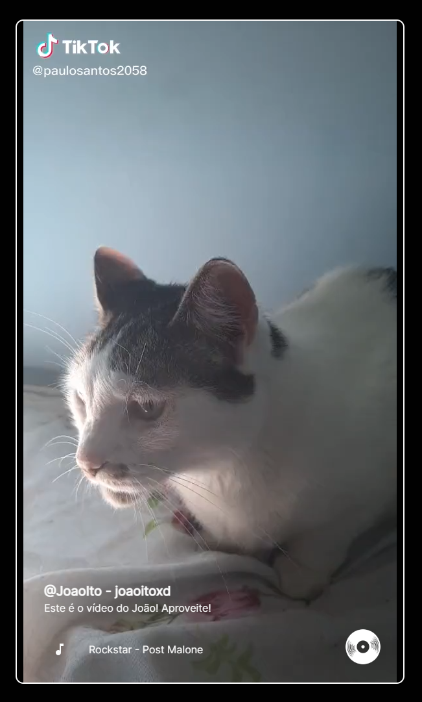

# Projeto FulStack TikTok _ Parceria com EBAC 

Este projeto é um projeto de um **clone full stack da aplicação do *Tikok***, com todas as funções são nativas do app original. A jornada está sendo feitas por uma imersão de aulas gratuitas oferecidas pela EBAC!

## Print base:

## Techs usadas (préviamente):

- Back-End e Banco de Dados ***[Firebase](https://firebase.google.com/?hl=pt-br)***

- Front-End ***[React.js](https://legacy.reactjs.org/)***

- Elementos para front ***[Material UI](https://mui.com/material-ui/getting-started/overview/)***

- Estilização ***[TailwindCSS](https://tailwindcss.com/)***

- Instalação da base build ***[Vite.js](https://vitejs.dev/)***

- Instalação de pacotes, e possível interação back-end, ***[node.js]()***